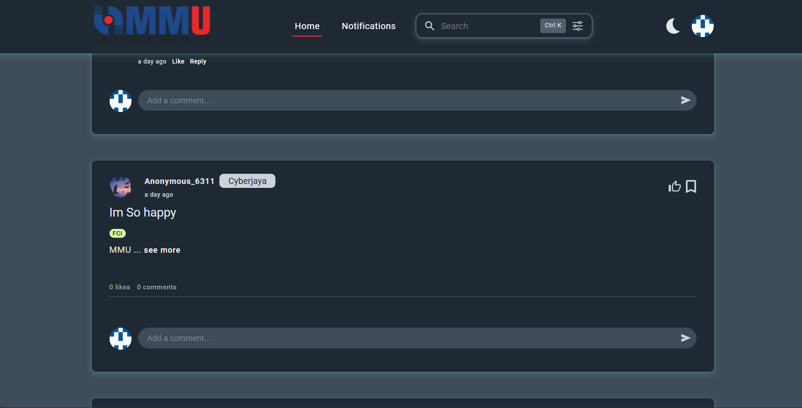
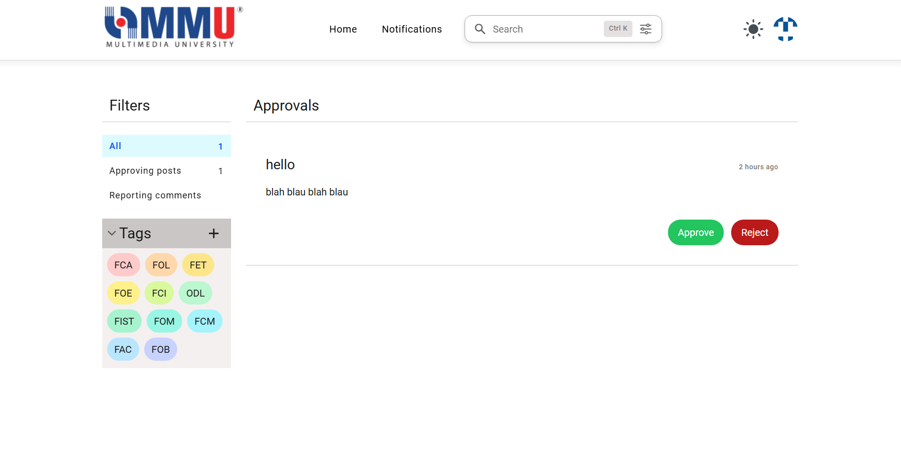

# MMU Confession

> A web application built with Flask

<br>



## Table of Contents

- [MMU Confession](#mmu-confession)
  - [Table of Contents](#table-of-contents)
  - [Introduction](#introduction)
  - [Features](#features)
  - [Prerequisites \& Installation Instructions](#prerequisites--installation-instructions)
    - [Approach 1: Install standalone executable file](#approach-1-install-standalone-executable-file)
    - [Approach 2: Install using pip](#approach-2-install-using-pip)
  - [Usage](#usage)
    - [Main Menu](#main-menu)
    - [User Profiles](#user-profiles)
    - [Admin Panel](#admin-panel)
    - [Confession Posts \& Comments](#confession-posts--comments)
  - [Acknowledgements](#acknowledgements)
  - [Author](#author)
  - [Contact](#contact)

<br>

If you are a developer, please refer to [here](docs/doc.md).

## Introduction

MMU Confession is a web application designed to allow members of the Multimedia University (MMU) community to share their confessions anonymously. Inspired by popular confession pages, this app offers a platform where users can express themselves freely while ensuring their privacy is maintained. The app is built using Flask and is intended for use in a browser.

## Features

1. **User Authentication**

   - 🔐 Account management functionalities including registration, login, logout, and password change.

2. **User Profiles**

   - 🖼️ Customizable profiles with avatars.
   - 📄 View created and liked posts, replied messages, and bookmarks.

3. **Admin Approval System**

   - ✅ Admin approval for submitted posts with statuses such as rejected, pending, and approved.
   - 🔍 Confessions require admin approval before being publicly posted.

4. **Tagging System**

   - 🏷️ Users can tag their confessions with relevant pre-made tags (e.g., faculties, topics).

5. **Notification System**

   - 🔔 Users receive notifications for various actions, such as replies to their confessions or comments.

6. **Confession Posts & Comments**

   - ✍️ Basic CRUD operations for confessions and comments, including anonymous submissions.
   - 👍 Like and reply functionalities for comments.
   - 🚩 Reporting feature for inappropriate content.

7. **Extra Features**
   - 🔍 Search and Filter Options: Assists users in finding specific confessions easily.
   - 📑 Pagination: Simplifies navigation through numerous posts by dividing them into pages.

<br>

## Prerequisites & Installation Instructions

### Approach 1: Install standalone executable file

1. Download the executable file (.exe) [here](https://github.com/djesmond1015/mmu_confession/blob/main/mmuConfession.zip).
2. Run the executable file.
3. Enjoy the application.

<br>

### Approach 2: Install using pip

1. Git clone the repository or download the zip file.

```bash
git clone https://github.com/djesmond1015/mmu_confession.git
```

<br>

2. Create a virtual environment. (optional)

We strongly recommend running the app in a virtual environment. You can create a virtual environment by typing the following command in the terminal.

```bash
python -m venv venv
```

<br>

Activate the virtual environment by typing the following command in the terminal.

If you are using Linux or macOS, type the following command in the terminal.

```bash
source venv/bin/activate
```

If you are using Windows, type the following command in the terminal.

```command prompt
venv\Scripts\activate
```

<br>

3. Install the dependencies using pip.

Ensure you have Python 3.6 or higher installed on your system. If not, please install it first.

```bash
pip install -r requirements.txt
```

<br>

4. Run the application.

Once the installation is complete, you can run the app by typing the following command in the terminal.

```bash
python -u src/main.py
```

<br>

## Usage

### Main Menu

When you first access the application, you will be greeted with the Main Menu:


<br>

### User Profiles

Users can customize their profiles with avatars and view their created and liked posts, replied messages, and bookmarks.


<br>

### Admin Panel

Admins have the ability to approve submitted posts, ensuring that only appropriate content is posted. They can mark posts as rejected, pending, or approved.


<br>

### Confession Posts & Comments

Users can submit anonymous confessions, comment on posts, and like and reply to comments. There are also reporting features for inappropriate content.


<br>

## Acknowledgements

1. [Flask Documentation](https://flask.palletsprojects.com/)
2. [WTForms Documentation](https://wtforms.readthedocs.io/)
3. [Bootstrap Documentation](https://getbootstrap.com/)

<br>

## Author

Made with ❤️ by Desmond Lee & Robin Chew

<br>

## Contact

If you have any questions, feel free to contact us at:

- Gmail: lee.desmond2016@gmail.com
- Github: [Desmond Lee](https://github.com/djesmond1015)

Don't forget to give us a star if you like this project! ⭐🥰
